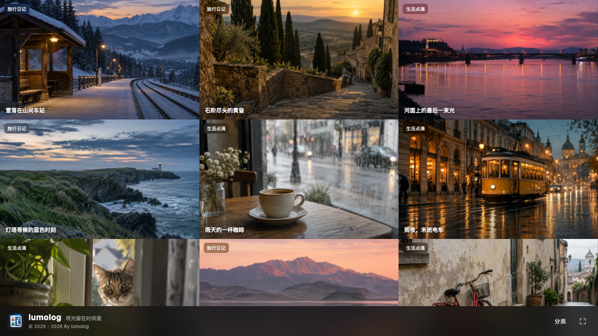

<div align="center">


# lumolog

将光留在时间里。一款基于 Next.js 的摄影图集，使用本地 TypeScript 或远程 JSON 管理作品与照片。



</div>

## 项目简介

lumolog 以响应式照片墙展示摄影作品。访客可以按分类或标签浏览，在弹层中查看组图、说明、图片来源与拍摄信息；有经纬度的照片还可以打开地图。作品墙每页显示 12 组作品，滚动时自动加载后续内容，并提供继续浏览的链接。

项目使用 Next.js App Router、React 和 TypeScript。作品数据默认来自仓库根目录的 `data.ts`，也可以在服务端从远程 JSON 地址实时读取。网站不提供上传或管理界面。

## 运行

需要 Node.js 20.9 或更新版本。下载项目后运行：

```sh
npm ci
npm run dev
```

打开终端显示的本地地址即可预览。

默认读取 [`data.ts`](data.ts)；它是一份完整、可直接编辑的作品数据文件。修改本地文件后重新部署，线上网站就会使用新内容。

如需独立于网站部署更新图库，在部署平台设置服务端环境变量 `GALLERY_JSON_URL`，填入公开的 HTTPS JSON 地址。配置后，远程文件**完全替代**本地文件；每次请求都会读取并校验它。修改远程 JSON 后刷新网站即可看到更新，不必重新部署。远程源站/CDN 若缓存旧文件，更新会受其缓存时间影响。

`SITE_URL` 用于分享卡片和站点地图的绝对网址，部署时建议填写网站的公开域名。完整配置示例见 [`.env.example`](.env.example)。

## 图片数据格式

本地 `data.ts` 和远程 JSON 使用相同的数据结构。`version` 固定为 `1`；作品和照片的 `id` 使用小写英文字母、数字与连字符，且各自在所属范围内唯一。本地文件编辑 `data` 对象，远程文件只保留对象本身，使用 JSON 格式。

```ts
import type { Gallery } from './src/lib/gallery-schema';

const data: Gallery = {
  "version": 1,
  "albums": [
    {
      "id": "coast",
      "title": "灯塔等候的蓝色时刻",
      "date": "2026-09-21",
      "description": "海风越过草坡。",
      "categories": ["旅行日记"],
      "tags": ["海岸", "黄昏"],
      "location": "北方海岸",
      "photos": [
        {
          "id": "coast-1",
          "src": "https://images.example.com/coast.jpg",
          "thumb": "https://images.example.com/coast-thumb.jpg",
          "metadataSrc": "https://images.example.com/coast-original.jpg",
          "alt": "蓝色时刻的海岸与灯塔",
          "caption": "浪花留下最后一层银白。",
          "credit": {
            "name": "摄影师或图片来源",
            "url": "https://example.com/original",
            "license": "授权说明"
          },
          "camera": "Sony A7 IV",
          "lens": "35mm F1.8",
          "focal_length": "35 mm",
          "aperture": "2.8",
          "shutter": "1/125",
          "iso": 400,
          "taken": "2026-09-21 18:00",
          "location": "海边步道",
          "lat": 55.2,
          "lon": -6.2
        }
      ]
    }
  ]
};

export default data;
```

每组作品必须有 `id`、`title`、ISO 日期 `date` 和至少一张照片；每张照片必须有 `id`、`src` 和描述图片内容的 `alt`。其余字段可省略。作品与组内照片都按数据中的顺序显示，调整数组顺序即可重新排序。`categories` 和 `tags` 自动生成相应页面。`thumb` 缺省时使用 `src`，建议为图片墙提供单独的轻量缩略图。

`src`、`thumb`、`metadataSrc` 使用公开 HTTPS 图片链接，或项目 `public/images/` 下的 `/images/...` 路径。远程 JSON 可以随时指向新的公开图片；要新增或替换项目内的图片文件，则仍需重新部署。`credit` 会在照片弹层显示来源和原始链接。示例作品的来源均标为“lumolog 原创生成影像”，地图坐标仅为演示。

## 拍摄信息与故障处理

打开照片时，如果相机、镜头、焦距、光圈、快门、ISO 或拍摄时间有未填写的字段，服务端会从 `metadataSrc`（未填写时从 `src`）读取图片 EXIF，逐项补全；手动填写的值优先。项目内 `/images/...` 图片和远程 HTTPS 图片都支持读取。标题、描述、`alt`、位置和地图坐标仍需手动填写；地图坐标只使用数据中明确填写的 `lat` 与 `lon`，不会公开原图中的 GPS。远程图片源站需要允许服务端获取原图，且保留相关 EXIF；若元数据缺失或读取失败，只隐藏缺失的拍摄字段，不影响看图。示例图片没有真实拍摄 EXIF。

远程 JSON 不可访问或格式错误时，网站显示错误与重试入口，不会悄悄显示过期的本地内容。图片加载失败时显示占位画面。

## 部署

| 平台 | 设置 |
| --- | --- |
| Vercel | 导入仓库，选择 Next.js 预设；构建命令 `npm run build`。 |
| Netlify | 使用仓库中的 `netlify.toml`；构建产物为 `.next`。 |
| EdgeOne Pages | 使用仓库中的 `edgeone.json`；选择 Next.js 全栈部署，产物为 `.next`。 |

这三种部署都必须启用 Next.js 服务端运行模式，不能选择静态导出。`GALLERY_JSON_URL` 为可选项：不设置时使用仓库内的数据文件；设置后运行时读取远程文件。JSON 由外部服务编辑或替换，网站没有上传或管理界面。

## 检查

```sh
npm run lint
npm run test
npm run build
npm run start
```

本地生产模式已检查：示例作品、分类、标签、分页、弹层及移动端布局可用；通过本机 HTTP 模拟远程 JSON，验证了无需重建即可新增、删除和调整作品顺序，也检查了无效 JSON、失效图片及 EXIF 缺失时的显示。Vercel、Netlify、EdgeOne Pages 的平台预览部署尚未执行；当前工作区没有可用的三平台预览环境与部署授权，需要在各平台关联项目后再确认线上服务端读取和动态更新。

## 项目结构

```text
data.ts                 作品与照片数据
public/images/          标识、占位图和示例图片
src/app/                页面、接口与站点地图
src/components/         照片墙和弹层组件
src/lib/                数据校验、筛选和拍摄信息处理
```

版本变化见 [更新记录](CHANGELOG.md)。

## 许可

项目代码采用 [MIT 许可](LICENSE)，© 2026 [everfu](https://github.com/everfu)。
