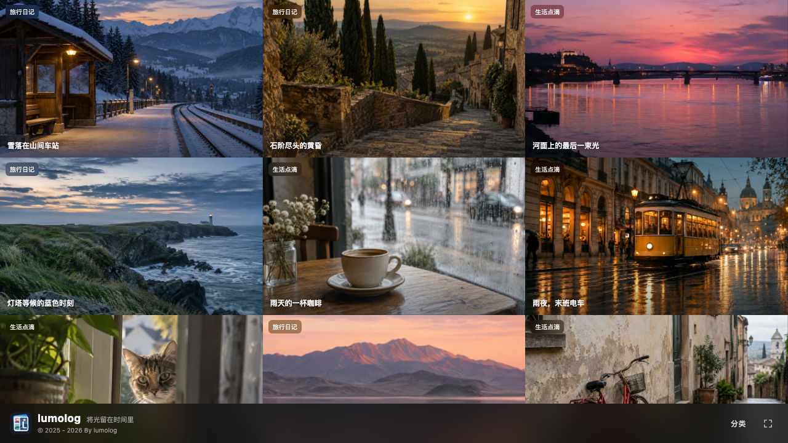

<div align="center">


# lumolog

将光留在时间里。一款基于 Next.js 的摄影图集，使用本地 TypeScript 或远程 JSON 管理作品与照片。



</div>

## 项目简介

lumolog 以响应式照片墙展示摄影作品。访客可以按分类或标签浏览。作品墙每页显示 12 组作品，滚动时自动加载后续内容，并提供继续浏览的链接。点击作品卡片可打开图片预览，通过按钮、方向键或左右滑动在当前已加载的作品间切换照片。

项目使用 Next.js App Router、React 和 TypeScript。作品数据默认来自仓库根目录的 `data.ts`，也可以在服务端从远程 JSON 地址实时读取。网站不提供上传或管理界面。

## 运行

需要 Node.js 24。下载项目后运行：

```sh
npm ci
npm run dev
```

打开终端显示的本地地址即可预览。

默认读取 [`data.ts`](data.ts)；它是一份完整、可直接编辑的作品数据文件。修改本地文件后重新部署，线上网站就会使用新内容。

如需独立于网站部署更新图库，在部署平台设置服务端环境变量 `GALLERY_JSON_URL`，填入公开的 HTTPS JSON 地址。配置后，远程文件**完全替代**本地文件；每次请求都会读取并校验它。修改远程 JSON 后刷新网站即可看到更新，不必重新部署。远程源站/CDN 若缓存旧文件，更新会受其缓存时间影响。

`SITE_URL` 用于分享卡片和站点地图的绝对网址，部署时建议填写网站的公开域名。远程图片还需要在构建和运行环境中设置 `IMAGE_REMOTE_ORIGINS`，以逗号分隔允许的 HTTPS 来源，例如 `https://images.example.com,https://cdn.example.com`。只填写来源，不要填写图片路径或通配符；新增来源后需重新部署。未设置时只允许项目内图片。完整配置示例见 [`.env.example`](.env.example)。

## 图片数据格式

本地 `data.ts` 和远程 JSON 使用相同的数据结构。`version` 固定为 `1`；作品和照片的 `id` 使用小写英文字母、数字与连字符，且各自在所属范围内唯一。本地文件编辑 `data` 对象，远程文件只保留对象本身，使用 JSON 格式。

```ts
import type { Gallery } from './src/lib/gallery-schema';

const data: Gallery = {
  "version": 1,
  "albums": [
    {
      "id": "coast",
      "title": "灯塔等候的蓝色时刻",
      "date": "2026-09-21",
      "description": "海风越过草坡。",
      "categories": ["旅行日记"],
      "tags": ["海岸", "黄昏"],
      "location": "北方海岸",
      "photos": [
        {
          "id": "coast-1",
          "src": "https://images.example.com/coast.jpg",
          "thumb": "https://images.example.com/coast-thumb.jpg",
          "alt": "蓝色时刻的海岸与灯塔"
        }
      ]
    }
  ]
};

export default data;
```

每组作品必须有 `id`、`title`、ISO 日期 `date` 和至少一张照片；每张照片必须有 `id`、`src` 和描述图片内容的 `alt`。其余字段可省略。作品按数据中的顺序显示，调整数组顺序即可重新排序。`categories` 和 `tags` 自动生成相应页面。`thumb` 缺省时使用 `src`，建议为图片墙提供单独的轻量缩略图。

`src`、`thumb` 使用 `IMAGE_REMOTE_ORIGINS` 允许的 HTTPS 图片链接，或项目 `public/images/` 下的 `/images/...` 路径。同一来源内的远程图片可以随时更新；添加新的图片来源或项目内图片文件需要重新部署。照片墙和标签页按屏幕尺寸加载图片；建议继续提供独立的轻量 `thumb`。作品说明、地点、日期和图片来源会在预览中显示。拍摄参数字段继续通过校验，但预览不会额外读取图片 EXIF。

## 故障处理

远程 JSON 不可访问、格式错误，或图片来源不在允许列表中时，网站显示错误与重试入口，不会悄悄显示过期的本地内容。服务端日志会指出图片来源配置问题。图片加载失败时显示占位画面。

## 部署

| 平台 | 设置 |
| --- | --- |
| Vercel | 导入仓库，选择 Next.js 预设和 Node.js 24；构建命令 `npm run build`。 |
| Netlify | 使用仓库中的 `netlify.toml`；构建产物为 `.next`。 |
| EdgeOne Pages | 使用仓库中的 `edgeone.json`；选择 Next.js 全栈部署，产物为 `.next`。 |

这三种部署都必须启用 Next.js 服务端运行模式，不能选择静态导出。Netlify 使用 Node.js 24，EdgeOne 使用 24.18.0。`GALLERY_JSON_URL` 为可选项：不设置时使用仓库内的数据文件；设置后运行时读取远程文件。`IMAGE_REMOTE_ORIGINS` 必须同时提供给构建和运行环境；JSON 由外部服务编辑或替换，网站没有上传或管理界面。

## 检查

```sh
npm run lint
npm run test
npm run build
npm run start
```

本地生产模式曾检查示例作品、分类、标签、分页及移动端布局；通过本机 HTTP 模拟远程 JSON，验证了无需重建即可新增、删除和调整作品顺序，也检查了无效 JSON 和失效图片的显示。Vercel、Netlify、EdgeOne Pages 的平台预览部署尚未执行；当前工作区没有可用的三平台预览环境与部署授权，需要在各平台关联项目后再确认线上服务端读取和动态更新。

## 项目结构

```text
data.ts                 作品与照片数据
public/images/          标识、占位图和示例图片
src/app/                页面、接口与站点地图
src/components/         照片墙组件
src/lib/                数据校验和筛选
```

版本变化见 [更新记录](CHANGELOG.md)。

## 许可

项目代码采用 [MIT 许可](LICENSE)，© 2026 [everfu](https://github.com/everfu)。
